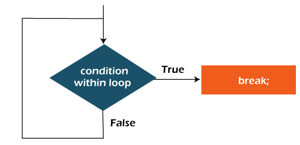

## Sentencia break de Java

- Cuando se encuentra una sentencia break dentro de un bucle, el bucle se termina inmediatamente y el control del programa se reanuda en la siguiente sentencia que sigue al bucle.

- La sentencia break de Java se utiliza para interrumpir un bucle o una sentencia switch. Rompe el flujo actual del programa en la condición especificada. En el caso de un bucle interno, sólo rompe el bucle interno.

- Podemos utilizar la sentencia break de Java en todo tipo de bucles como el bucle for, while y el do-while.

- Sintaxis:

```Java
Declaración de salto
break;
```

## Diagrama de flujo de la declaración break



## Sentencia break con bucle de Java

- Ejemplo:

```Java
public class example{
    public static void main(String[] args){
        //Uso bucle for
        for(int i=1;i<=10;i++){
            if(i==5){
                //uso del break
                break;
            }
            System.out.println(i);
        }
    }
}
```

```
Output:
1
2
3
4
```

## Sentencia break con bucle interno de Java

- Rompe el bucle interno sólo si se utiliza la sentencia break dentro del bucle interno.

- EJemplo:

```Java
public class example{
    public static void main(String[] args){
       //bucle externo
       for(int i=1;i<=3;i++){
            //bucle interno
            for(int j=1;j<=3;j++){
                if(i==2&&j==2){
                    //Uso break
                    break;
                }
                System.out.println(i+" "+j);
            }
       }
        
    }
}
```

```
Output:
1 1
1 2
1 3
2 1
3 1
3 2
3 3
```

## Sentencia break con bucle for etiquetado de Java

- Podemos utilizar la sentencia break con una etiqueta. Esta característica se introdujo en JDK 1.5. Por lo tanto, podemos romper cualquier bucle en Java ahora si se trata de bucle externo o interno.

- Ejemplo:

```Java
public class example{
    public static void main(String[] args){
      //Uso etiqueta aa:
      aa:
      for(int i=1;i<=3;i++){
        //Uso etiqueta bb:
        bb:
        for(int j=1;j<=3;j++){
            if(i==2&&j==2){
                //Uso break con etiqueta
                break aa;
            }
            System.out.println(i+" "+j);
        }
      }
        
    }
}
```

```
Output:
1 1
1 2
1 3
2 1
```

## Sentencia break con bucle while de Java

- Ejemplo:

```Java
public class example{
    public static void main(String[] args){
      int i=1;
      //bucle while
      while(i<=10){
        if(i==5){
            i++;
            break;
        }
        System.out.println(i);
        i++;
      }
    }
}
```

```
Output:
1
2
3
4
```

## Sentencia break con bucle do-while de Java

- Ejemplo:

```Java
public class example{
    public static void main(String[] args){
      int i = 1;
      //bucle do-while
      do{
        if(i==5){
            i++;
            break;
        }
        System.out.println(i);
        i++;
      }while(i<=10); 
    }
}
```

```
Output:
1
2
3
4
```

#### - Para ver el break con [switch](/Java/Flujo%20de%20control/switch/README.md) visitar este lugar.