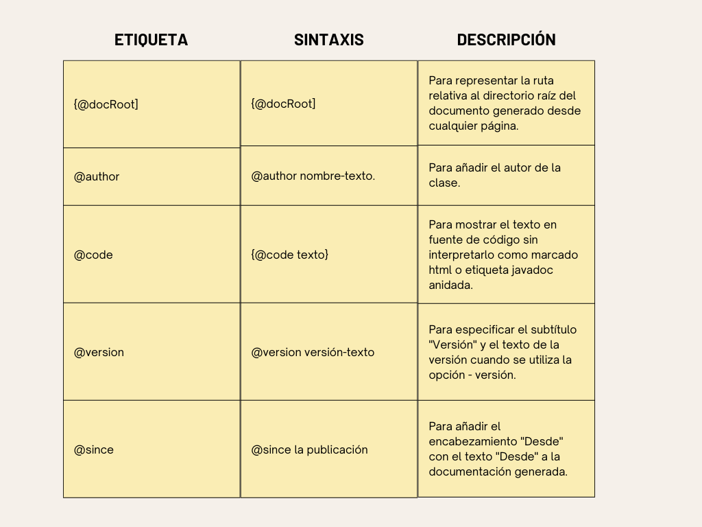
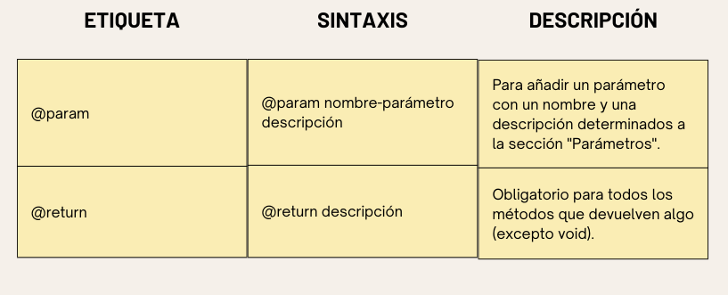

## Comentarios de Java

- Los comentarios Java son las sentencias de un programa que el compilador y el intérprete no ejecutan.

### ¿Por qué utilizamos comentarios en un código?

- Los comentarios se utilizan para hacer el programa más legible mediante la adición de los detalles del código.

- Facilitan el mantenimiento del código y la localización de errores.

- Los comentarios se pueden utilizar para proporcionar información o explicación sobre la variable, método, clase, o cualquier declaración.

- También se pueden utilizar para evitar la ejecución del código del programa mientras se prueba el código alternativo.

### Tipos de comentarios de Java

- Hay tres tipos de comentarios en Java:

    - Comentario de una línea: El comentario de una sola línea se usa para comentar solo una línea.
    - Comentario Multilínea: El comentario de varias líneas se utiliza para comentar varias líneas de código.
    - Comentario de documentación: El comentario de documentación se utiliza para crear la API de documentación. Para crear una API de documentación, debe usar la herramienta javadoc.


1) Comentario de una sola línea de Java

- El comentario de una sola línea se utiliza para comentar sólo una línea del código. Es la forma más utilizada y sencilla de comentar las sentencias.

- Los comentarios de una sola línea comienzan con dos barras inclinadas (//). Cualquier texto delante de // no es ejecutado por Java.

- Sintaxis:

```Java
// Este es un comentario de una sola línea
```

- Ejemplo:

```Java
public class example{
    public static void main(String[] args){
        int i = 10; //i es una variable con valor 10
        System.out.println(i); //se ocupa para imprimir en consola
    }
}
```

```
Output:
10
```

2) Comentario multilínea Java

- El comentario multilínea se utiliza para comentar varias líneas de código.

- Se puede utilizar para explicar un fragmento de código complejo o para comentar varias líneas de código a la vez (ya que ahí será difícil utilizar comentarios de una sola línea).

- Los comentarios multilínea se colocan entre /* y */. Cualquier texto entre /* y */ no es ejecutado por Java.

- Sintaxis:

```Java
/*
Esto
es
un
comentario 
multilínea
*/
```

- Ejemplo:

```Java
public class example{
    public static void main(String[] args){
        /*Vamos a declarar e imprimir 
        la variable en Java*/
        int i = 10;
        System.out.println(i);
        /* 
        float j = 5.9;
        float k = 4.4;
        System.out.println(j+k);
        */
    }
}
```

```
Output:
10
```

- Nota: Normalmente se utiliza // para comentarios cortos y /* */ para comentarios más largos.

3) Comentario sobre la documentación de Java

- Los comentarios de documentación se suelen utilizar para escribir grandes programas para un proyecto o aplicación de software, ya que ayudan a crear API de documentación. Estas API son necesarias para la referencia, es decir, qué clases, métodos, argumentos, entre otros, se utilizan en el código.

- Para crear API de documentación, necesitamos utilizar la herramienta javadoc. Los comentarios de documentación se colocan entre /** y */.

- Sintaxis:

```Java
/**
 * Podemos utilizar varias etiquetas para representar el parámetro 
 * o título o nombre de autor
 * También podemos utilizar etiquetas HTML
 * 
 */
```

## Etiquetas javadoc

- Algunas de las etiquetas más utilizadas en los comentarios de la documentación:




```Java
import java.io.*;
/**
 * <h2> Calculo de numeros</h2>
 * Este programa implementa una aplicación
 * para realizar operaciones como la suma de números
 * e imprimir el resultado
 * <p>
 * <b>Nota:
 * </b> Los comentarios hacen que el código sea legible y
 * facil de entender
 * 
 * @author Diego Salazar
 * @version 1.0
 * @since 17-08-2023
 */ 

public class calculo{
    /**
     * Este método calcula la suma de dos números enteros.
     * @param input1 Es el primer parámetro del método sum()
     * @param input2 Es el segundo parámetro del método sum()
     * @return Devuelve la suma de input1 y input2
     */
     public int sum(int input1, int input2){
        return input1 + input2;
     }
     /**
      * Este es el método principal usos del método sum().
      * @param args Sin usar
      * @see IOException
      */
     public static void main(String[] args){
        calculo obj = new calculo();
        int resultado = obj.sum(40,20);

        System.out.println("La suma es: "+resultado);
     } 
}
```
