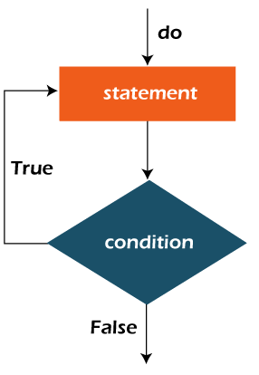

## Bucle do-while de Java

- El bucle do-while de Java se utiliza para iterar una parte del programa repetidamente, hasta que la condición especificada sea cierta. Si el número de iteraciones no es fijo y debe ejecutar el bucle al menos una vez, se recomienda utilizar un bucle do-while.

- El bucle do-while de Java se denomina bucle de control de salida. Por lo tanto, a diferencia del bucle while y del bucle for, el bucle do-while comprueba la condición al final del cuerpo del bucle.

- El bucle do-while se ejecuta al menos una vez porque la condición se comprueba después del cuerpo del bucle.

- Sintaxis:

```Java
do{
//Ejecución código
//actualización en la expresión usada en la condición
}while(Condición)
```

## Las diferentes partes del bucle do-while:

1. Condición: Es una expresión que se comprueba. Si la condición es verdadera, el cuerpo del bucle se ejecuta y el control pasa a actualizar la expresión. Tan pronto como la condición se convierte en falsa, el bucle se rompe automáticamente.

- Ejemplo:

Condición: i<=100

2. Expresión de actualización: Cada vez que se ejecute el cuerpo del bucle, esta expresión incrementa o decrementa la variable del bucle.

- Ejemplo:

Expresión de actualización: i++

- Recordatorio: El bloque do se ejecuta al menos una vez, incluso si la condición es falsa.

## Diagrama de flujo del bucle do-while:



- Ejemplo:

- En el siguiente ejemplo, imprimimos valores enteros del 1 al 10. A diferencia del bucle for, necesitamos inicializar e incrementar por separado la variable utilizada en la condición. De lo contrario, el bucle se ejecutara infinitamente.

```Java
public class example{
    public static void main(String[] args){
        int i = 1;
        do{
            System.out.println(i);
            i++;
        }while(i<=10);
    }
}
```

```
Output:
1
2
3
4
5
6
7
8
9
10
```

## Bucle do-while infinito de Java

- Si dentro de la condición del while se le coloca "true", este será infinito.

- Sintaxis:

```Java
do{
//Ejecución código
}while(true);
```

- Ejemplo:

```Java
public class example{
    public static void main(String[] args){
        do{
            System.out.println("Bucle do-while infinito")
        }while(true);
    }
}
```

```
Output:
Bucle do-while infinito
Bucle do-while infinito
Bucle do-while infinito
Bucle do-while infinito
.
.
.
.
```

- Tip: Para terminar la ejecución del bucle es la combinación de teclas ctrl + c.