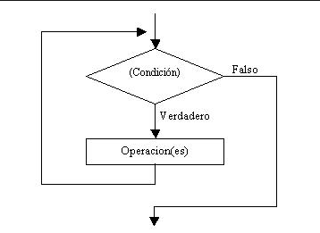
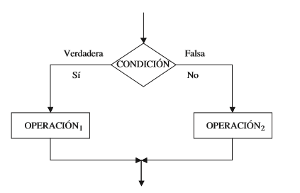
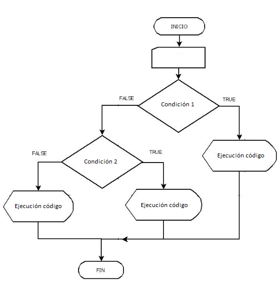
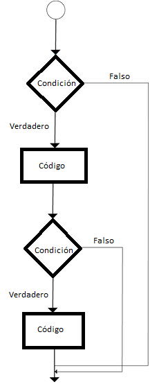

## Sentencia if de Java

- La sentencia if de Java se utiliza para comprobar la condición. 
- Comprueba la condición booleana:
    - Verdadero
    - Falso

- Hay varios tipos de sentencias if en Java.

    - Sentencia if
    - Sentencia if-else
    - Escalera if-else-if
    - Sentencia if anidada

## Declaración if de Java

- La sentencia if de Java comprueba la condición. Ejecuta el bloque if si la condición es verdadera.

```Java
if(condición){
    //ejecución del código
}
```



- Ejemplo uso sentencia if:

```Java
public class example{
    public static void main(String[] args){
        int edad = 20;
        if(edad>19){
           System.out.println("La edad es mayor a 19")
        }
    }
}
```

```
Output:
La edad es mayor a 19
```

## Declaración if-else de Java

- La sentencia if-else de Java también comprueba la condición.

- Ejecuta el bloque if si la condición es verdadera, de lo contrario se ejecuta el bloque else.

```Java
if(condición){
    //ejecución del código si la condición es verdadera
}
else{
    //ejecución del código en caso de que no se cumpla la condición del if 
}
```



- Ejemplo uso sentencia if-else:

```Java
public class example{
    public static void main(String[] args){
        int a= 20;
        if(a % 2 == 0){
           System.out.println("número par")
        }
        else{
             System.out.println("número impar")
        }
    }
}
```

```
Output:
número par
```

- Ejemplo año bisiesto:

```Java
public class example{
    public static void main(String[] args){
        int año= 2020;
        if((año % 4 == 0) && (año % 100 != 0) || (año % 400 == 0)){
           System.out.println("Año bisiesto")
        }
        else{
             System.out.println("Año común")
        }
    }
}
```

```
Output:
Año bisiesto
```

## Uso del operador ternario:

- También podemos utilizar el operador ternario (?:) para realizar la tarea de la sentencia if...else.

- Es una forma abreviada de comprobar la condición.

- Si la condición es verdadera, se devuelve el resultado de ?

- Si la condición es falsa, se devuelve el resultado :

```Java
public class example{
    public static void main(String[] args){
        int a = 13;
        String output = (number%2==0)?"número par":"número impar";
        System.out.println(output);
    }
}
```

```
Output:
número impar
```

## Declaración de escalera if-else-if de Java

- La sentencia de escalera if-else-if ejecuta una condición a partir de varias sentencias.

- Ejemplo uso sentencia if-else-if:

```Java
if(condición1){
    //Se ejecuta el código si la condición 1 es verdadera
}
else if(condición2){
    // Se ejecuta el código si la condición 2 es verdadera
}
else{
    // Se ejecuta el código si la condición 1 y 2 son falsas
}
```



- Ejemplo:

```Java
public class example{
    public static void main(String[] args){
        int nota = 65;
        if(nota<40){
            System.out.println("Reprobado");
        }
        else if(nota>=40 && nota <50 ){
            System.out.println("Aprobado en el rango 40-49");
        }
        else if(nota>=50 && nota <60){
            System.out.println("Aprobado en el rango 50-59")
        }
        else if(nota >=60 && nota <70){
            System.out.println("Aprobado en el rango 60-69")
        }
        else if(nota == 70){
            System.out.println("Aprobado con la nota máxima")
        }
        else{
            System.out.println("Nota invalida")
        }
    }
}
```

```
Output:
Aprobado en el rango 60-69
```

- Ejemplo para comprobar número positivo, negativo o cero:

```Java
public class example{
    public static void main(String[] args){
        int numero = -10;

        if(numero>0){
            System.out.println("Número positivo");
        }
        else if(numero<0){
            System.out.println("Número negativo");
        }
        else{
            System.out.println("Cero")
        }
    }
}
```

```
Output:
Número negativo
```

## Sentencia if anidada de Java

- La sentencia if anidada representa el bloque if dentro de otro bloque if.

-  En este caso, la condición del bloque if interno sólo se ejecuta cuando la condición del bloque if externo es verdadera.

```Java
if(condición1){
    //Se ejecuta el código si la condición 1 es verdadera
}
    if(condición2){
        //Se ejecuta el código si la condición 2 es verdadera
    }
```



- Ejemplo donante de sangre con if anidado:

```Java
public class example{
    public static void main(String[] args){
        int edad = 20;
        int peso = 80;
        if(edad>=18){
            if(peso>50){
                 System.out.println("Puede donar sangre");
            }
        }
    }
}
```

```
Output:
Puede donar sangre
```

- Ejemplo 2 donante de sangre con if anidado:

```Java
public class example{
    public static void main(String[] args){
        int edad = 25;
        int peso = 48;
        if(edad>=18){
            if(peso>50){
                 System.out.println("Puede donar sangre");
            }
            else{
                System.out.println("No puede donar sangre");
            }
        }
        else{
            System.out.println("Es menor de 18 años");
        }
    }
}
```

```
Output:
No puede donar sangre
```