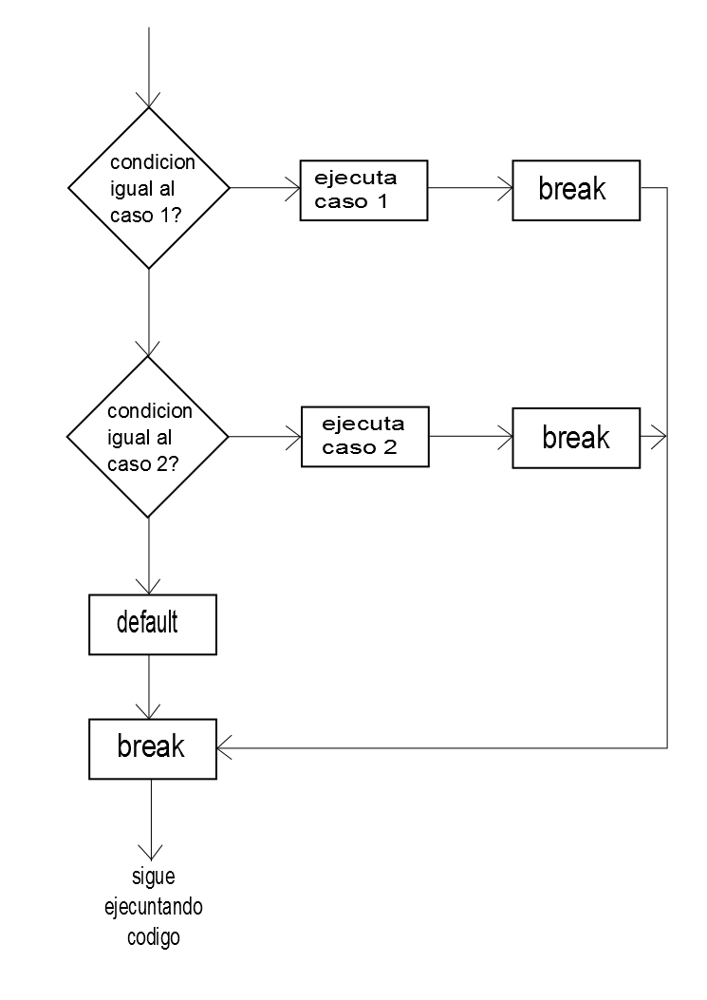

## Sentencia Switch de Java

- La sentencia switch de Java ejecuta una sentencia a partir de múltiples condiciones.

- Es como la sentencia escalera if-else-if.

- La sentencia switch funciona con tipos de byte, short, int, long, enum, String y algunos tipos envolventes como Byte, Short, Int y Long.

- Desde Java 7, se puede utilizar cadenas en la sentencia switch.

## Cosas a mencionar:

- Puede haber uno o N números de valores case para una expresión siwtch.

- El valor case debe ser sólo de tipo expresión switch. El valor case debe ser literal o constante. No admite varibles.

- Los valores case deben ser únicos. En caso de valor duplicado, se produce un error de compilación.

- La expresión switch de Java debe ser de tipo byte, short, int, long (con su tipo envoltura o Wrapper), enums y string.

- Cada sentencia case puede tener una sentencia break que es opcional. Cuando el control llega a la sentencia break, salta el control después de la expresión switch. Si no se encuentra una sentencia break, se ejecuta el siguiente case.

- El valor del case puede tener una etiqueta por defecto que es opcional.

- Ejemplo:

```
switch(expresión){
    case valor1:
    //Ejecución código
    break; //opcional

    case valor2:
    //Ejecución código
    break; //opcional
    .
    .
    .
    .

    default:
    // Se ejecuta cuando los valores del case no se hayan encontrado.
}
```



- Ejemplo sentencia switch:

```Java
public class example{
    public static void main(String[] args){
        int numero = 20;
        switch(numero){
            case 10: 
            System.out.println("10");
            break;
            case 20:
            System.out.println("20");
            break;
            case 30:
            System.out.println("30");
            break;
            default: 
            System.out.println("No se encuentra el 10, 20 o 30")
        }
    }
}
```
```
Output:
20
```

- Ejemplo encontrar mes con switch:

```Java
public class example{
    public static void main(String[] args){
        int mes = 7;
        switch(mes){
            case 1: 
            System.out.println("Enero");
            break;
            case 2:
            System.out.println("Febrero");
            break;
            case 3:
            System.out.println("Marzo");
            break;
            case 4:
            System.out.println("Abril");
            break;
            case 5:
            System.out.println("Mayo");
            break;
            case 6:
            System.out.println("Junio");
            break;
            case 7:
            System.out.println("Julio");
            break;
            case 8:
            System.out.println("Agosto");
            break;
            case 9:
            System.out.println("Septiembre");
            break;
            case 10:
            System.out.println("Octubre");
            break;
            case 11:
            System.out.println("Noviembre");
            break;
            case 12:
            System.out.println("Diciembre");
            break;
            default: 
            System.out.println("Mes invalido")
        }
    }
}
```
```Java
Output:
Julio
```

- Ejemplo para comprobar vocal o consonante:

- Si el carácter es A, E, I, O o U, es vocal o consonante. No se distingue entre mayúsculas y minúsculas.


```Java
public class example{
    public static void main(String[] args){
        char ch = 'O'
        switch(ch){
            case 'a': 
            System.out.println("Vocal");
            break;
            case 'e':
            System.out.println("Vocal");
            break;
            case 'i':
            System.out.println("Vocal");
            break;
            case 'o':
            System.out.println("Vocal");
            break;
            case 'u':
            System.out.println("Vocal");
            break;
            case 'A':
            System.out.println("Vocal");
            break;
            case 'E':
            System.out.println("Vocal");
            break;
            case 'I':
            System.out.println("Vocal");
            break;
            case 'O':
            System.out.println("Vocal");
            break;
            case 'U':
            System.out.println("Vocal");
            break;
            default: 
            System.out.println("Consonante")
        }
    }
}
```
```Java
Output:
Vocal
```

## Declaración switch sin break

- La sentencia switch de Java es "fall-trough". Esto significa que ejecuta todas las sentencias después de la primera coincidencia si no hay una sentencia break presente.

- Ejemplo:

```Java
public class example{
    public static void main(String[] args){
        int numero = 20;
        switch(numero){
            case 10: 
            System.out.println("10");
            case 20: 
            System.out.println("20");
            case 30: 
            System.out.println("30");
            default: 
            System.out.println("No se encuentra el 10, 20 o 30")
        }
    }
}
```

```
//Muestra todo esto debido a que no tenemos break en el case
Output:
20
30
No se encuentra el 10, 20 o 30
```


## Sentencia switch con String de Java

- Java nos permite utilizar cadenas en la expresión switch desde Java SE 7.

- La sentencia case debe ser una cadena literal.

- Ejemplo:

```Java
public class example{
    public static void main(String[] args){
        String Stringnivel = "Experto";
        int nivel = 0;
        switch(Stringnivel){
            case "Principiante": 
            nivel = 1;
            break;
            case "Intermedio": 
            nivel = 2;
            break;
            case "Experto": 
            nivel = 3;
            break;
            default: 
            nivel = 0;
            break;
        }
        System.out.println("Tu nivel es: "+nivel)
    }
}
```

```
Output:
Tu nivel es: 3
```

## Declaración de switch anidado de Java

- Podemos utilizar una sentencia switch dentro de otra sentencia switch en Java. Se conoce como sentencia switch anidada.

- Ejemplo:

```Java
public class example{
    public static void main(String[] args){
        char curso = 'A';
        int añouniversidad = 4;
        switch(añouniversidad){
            case 1:
                System.out.println("Inglés, Matematicas, Ciencias sociales");
                break;
            case 2:
                switch(curso)
                {
                    case 'A':
                        System.out.println("Sistemas operativos, Java, Estructura de datos");
                        break;
                    case 'B':
                        System.out.println("Microprocesadores");
                        break;
                    case 'C':
                        System.out.println("Inteligencia artificial");
                        break;
                }
                break;
            case 3:
                switch(curso)
                {
                    case 'A':
                        System.out.println("Teoría automatas");
                        break;
                    case 'B':
                        System.out.println("Ciencias de la computación");
                        break;
                    case 'C':
                        System.out.println("Redes neuronales");
                        break;
                }
                break;
            case 4:
                switch(curso)
                {
                    case 'A':
                        System.out.println("Sistemas embebidos");
                        break;
                    case 'B':
                        System.out.println("Desarrollo web");
                        break;
                    case 'C':
                        System.out.println("Desarrollo aplicaciones escritorio");
                        break;
                }
                break;
        }
    }
}
```

```
Output:
Sistemas embebidos
```

## Enumeración en switch de Java

- Java nos permite utilizar enum en la sentencia switch, Java enum es una clase que representa el grupo de constantes (inmutable como las variables finales).

- Usamos la palabra clave enum y ponemos las constantes entre llaves separadas por comas.

- Ejemplo:

```Java
public class example{
    public enum Dia {Lun, Mar, Mie, Jue, Vie, Sab, Dom}
        public static void main(String[] args) {
                Dia[] diaactual = Dia.values();
                for (Dia Actual : diaactual) { //implementación for-each
                    switch (Actual) {
                        case Lun:
                        System.out.println("Lunes");
                        break;
                        case Mar:
                        System.out.println("Martes");
                        break;
                        case Mie:
                        System.out.println("Miercoles");
                        break;
                        case Jue:
                        System.out.println("Jueves");
                        break;
                        case Vie:
                        System.out.println("Viernes");
                        break;
                        case Sab:
                        System.out.println("Sabado");
                        break;
                        case Dom:
                        System.out.println("Domingo");
                        break;
                    }
                }

        }
}
```

```
Output:
Lunes
Martes
Miercoles
Jueves
Viernes
Sabado
Domingo
```

## Envoltura con switch de Java

- Java nos permite utilizar cuatro clases envolventes:
    - Byte
    - Short
    - Integer
    - Long

- Ejemplo votación:

```Java
public class example{
    public static void main(String[] args){
        Integer edad = 18;
        switch(edad){
            case (16): 
            System.out.println("Eres menor de edad, no puedes votar");
            case (18): 
            System.out.println("Eres mayor de edad, puedes votar");
            case (65): 
            System.out.println("Eres mayor de edad, puedes votar");
            default: 
            System.out.println("Ingresa una edad valida")
        }
    }
}
```

```
Output:
Eres mayor de edad, puedes votar
```