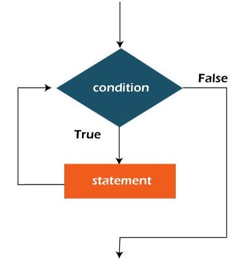

## Bucle while de Java

- El bucle while de Java se utiliza para iterar una parte del programa repetidamente hasta que la condición booleana especificada sea verdadera.

- Tan pronto como la condición booleana se convierte en falsa, el bucle se detiene automáticamente.

- El bucle while se considera como una sentencia if que se repite. Si el número de iteraciones no es fijo, se recomienda utilizar el bucle while.

- Sintaxis:

```Java
while(condición){
    //Ejecución código
    //Incremento/Decremento de la declaración
}
```

## Las diferentes partes del bucle while:

1. Condición: Es una expresión que se comprueba. Si la condición es verdadera, se ejecuta el cuerpo del bucle y el control pasa a actualizar la expresión. Cuando la condición es falsa, salimos del bucle while.

- Ejemplo:

Condición: i<=100

2. Expresión de actualización: Cada vez que se ejecuta el cuerpo del bucle, esta expresión incrementa o decrementa la variable del bucle.

- Ejemplo:

Expresión de actualización: i++

## Diagrama de flujo del bucle while de Java

- Aquí, lo importante acerca del bucle while es que, a veces puede que ni siquiera se ejecute.

- Si la condición a ser probada resulta falsa, el cuerpo del bucle es omitido y la primera sentencia después del bucle while será ejecutada.



- Ejemplo:

- En el siguiente ejemplo, imprimimos valores enteros del 1 al 10.

- A diferencia del bucle for, necesitamos inicializar e incrementar por separado la variable utilizada en la condición. De lo contrario, el bucle se ejecutará infinitamente.

```Java
public class example{
    public static void main(String[] args){
        int i = 1;
        while(i<=10){
            System.out.println(i);
            i++;
        }
    }
}
```

```
Output:
1
2
3
4
5
6
7
8
9
10
```

## Bucle while infinito de Java

- Si dentro de la condición del while se le coloca "true", este será infinito.

- Sintaxis:

```
while(true){
    //Ejecución código
}
```

- Ejemplo:

```Java
public class example{
    public static void main(String[] args){
        while(true){
            System.out.println("Bucle while infinito")
        }
    }
}
```

```
Output:
Bucle while infinito
Bucle while infinito
Bucle while infinito
Bucle while infinito
.
.
.
.
```

- Tip: Para terminar la ejecución del bucle es la combinación de teclas ctrl + c.