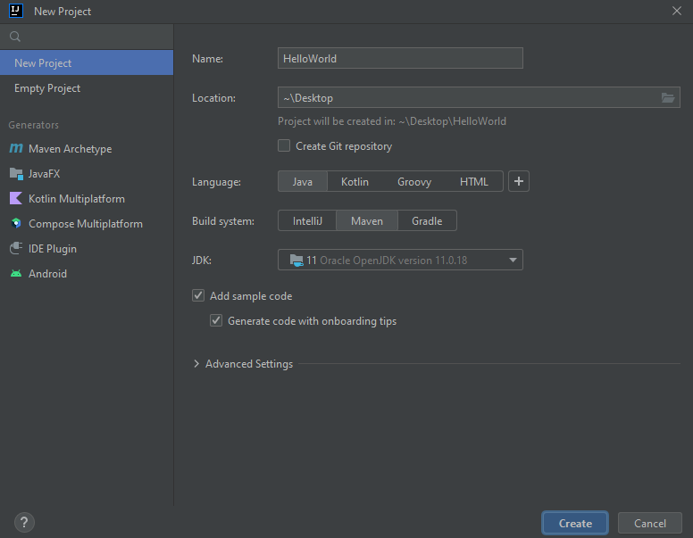
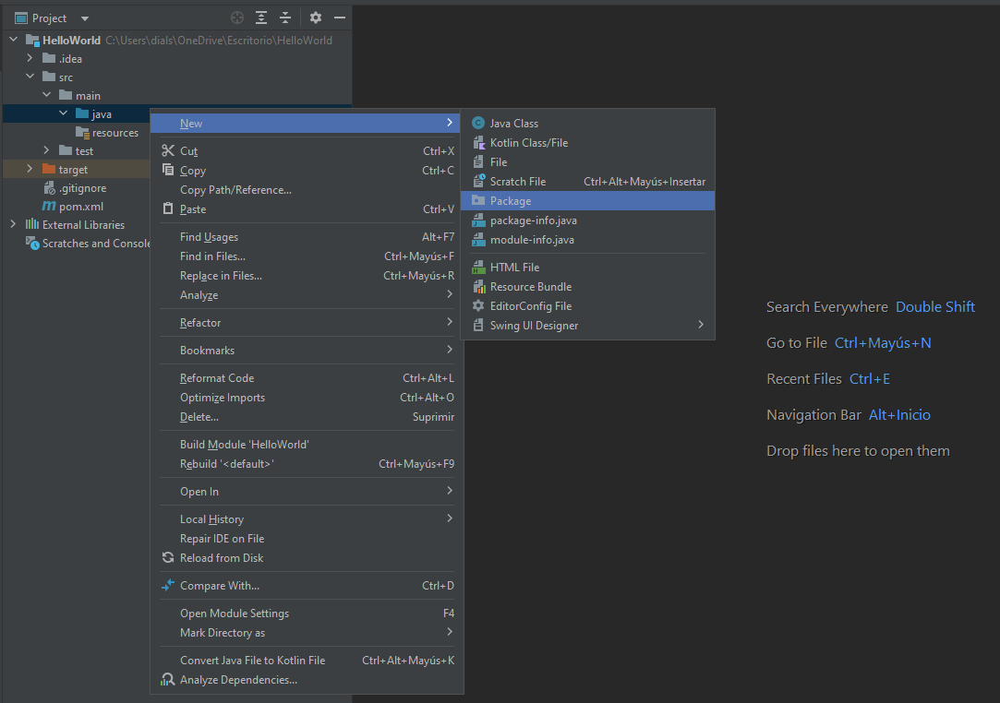
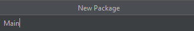
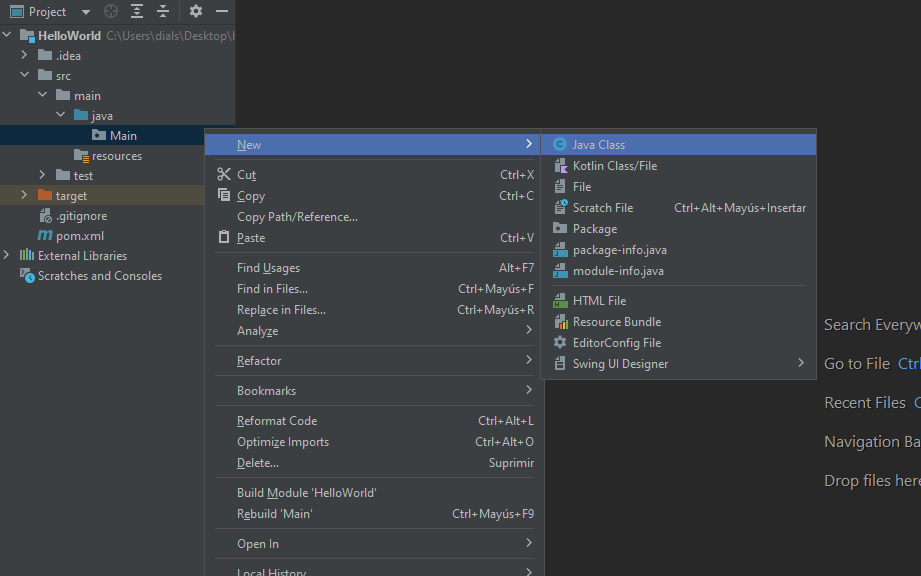
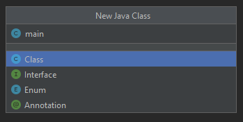
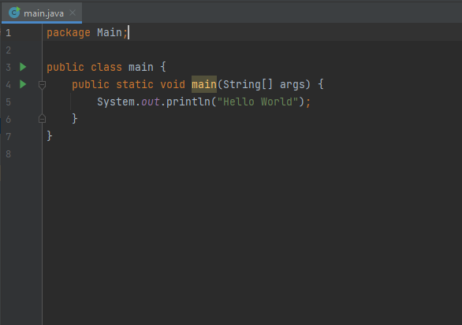
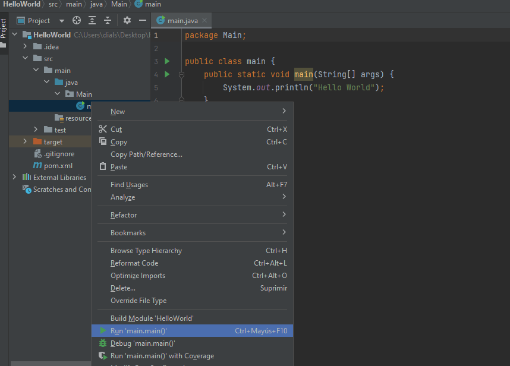
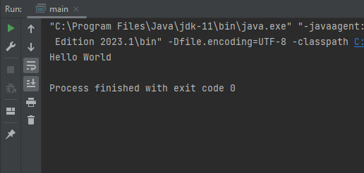

# Ejercicio Hello World!

## Pasos a seguir: 

- Primero hay que descargar el [IntelliJ IDEA](https://www.jetbrains.com/es-es/idea/download/?section=windows)

- Crear un nuevo proyecto: 

- Crear un nuevo paquete:

- Colocarle un nombre caracteristico al paquete, en este caso Main:

- Crea una clase de java dentro de nuestro paquete "Main":

- Colocarle un nombre caracteristico a la clase de java, en este caso main: 

- Realizar la clase main y imprimir por consola con "System.out.println": 
    - Tip 1: Para poder crear la clase main mas rapido escriben "main" dentro de la public class main{} y le dan a la tecla tab.
    - Tip 2: Para escribir el "System.out.println" mas rapido pueden escribir "sout" dentro de la public static void main(String[] args){} y le dan a la tecla tab.

- Ejecutar la clase main:

- Resultado en la consola:

