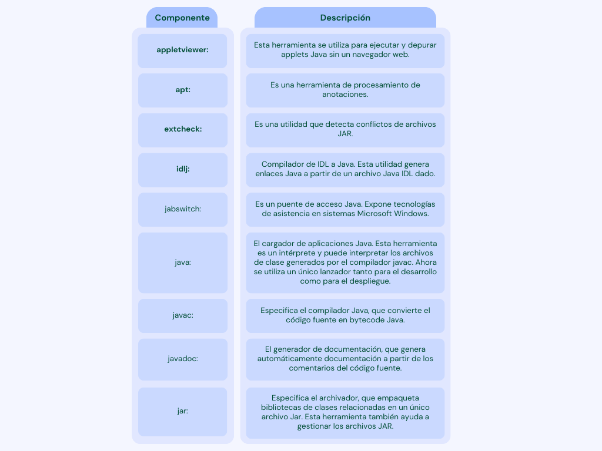
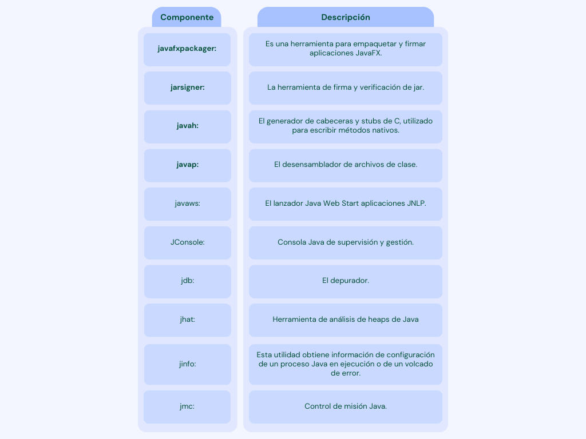
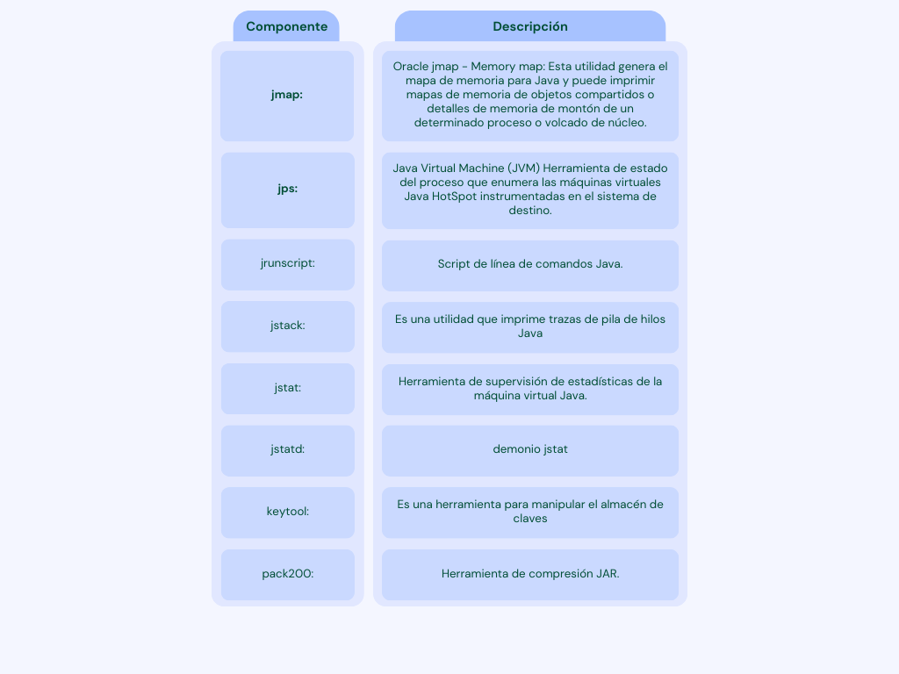
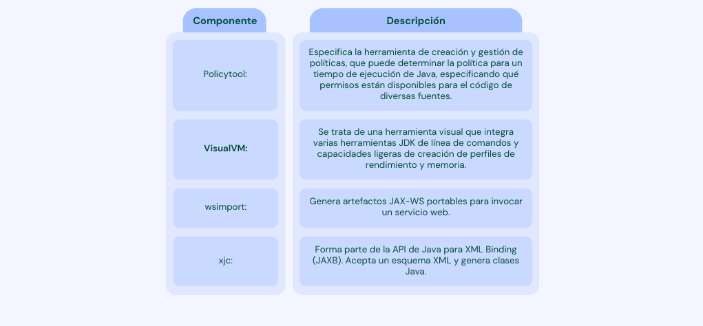

## JDK

- JDK es el acrónimo de Java Development Kit. 
- JDK es un entorno de desarrollo de software que se utiliza para desarrollar aplicaciones y applets java. 
- Contiene JRE + herramientas de desarrollo

- JDK es una implementación de cualquiera de las siguientes plataformas Java publicadas por la corporación Oracle:

    - Plataforma Java Standard Edition (Java SE)
    - Plataforma Java Enterprise Edition (Java EE)
    - Plataforma Java Micro Edition (Java ME)

- El JDK contiene una máquina virtual Java (JVM) privada y algunos otros recursos como un intérprete/cargador (java), un compilador (javac), etc.

## Componentes de JDK

- Lista de los principales componentes del JDK:

