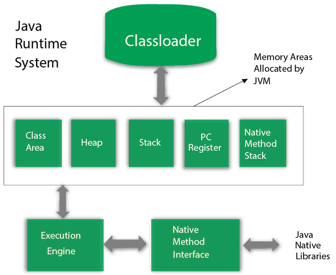
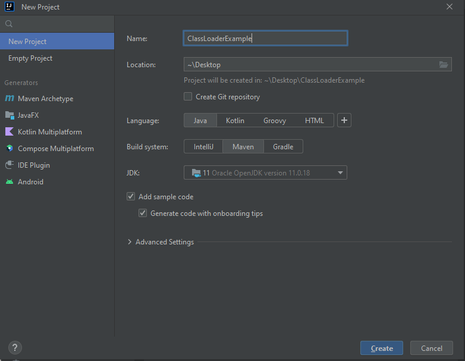
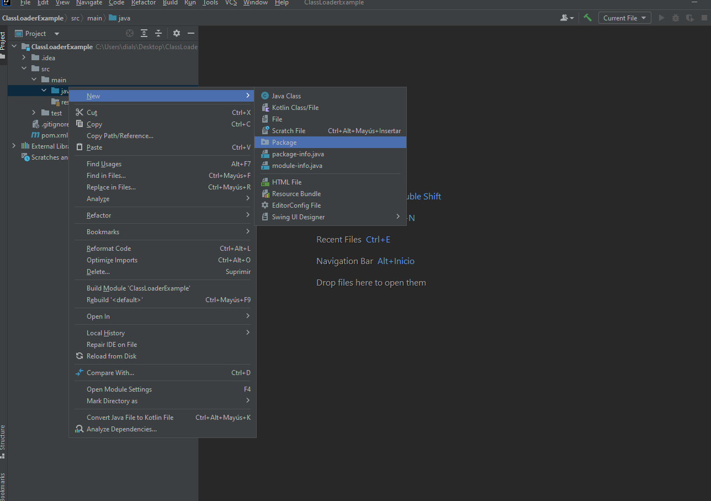
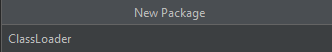
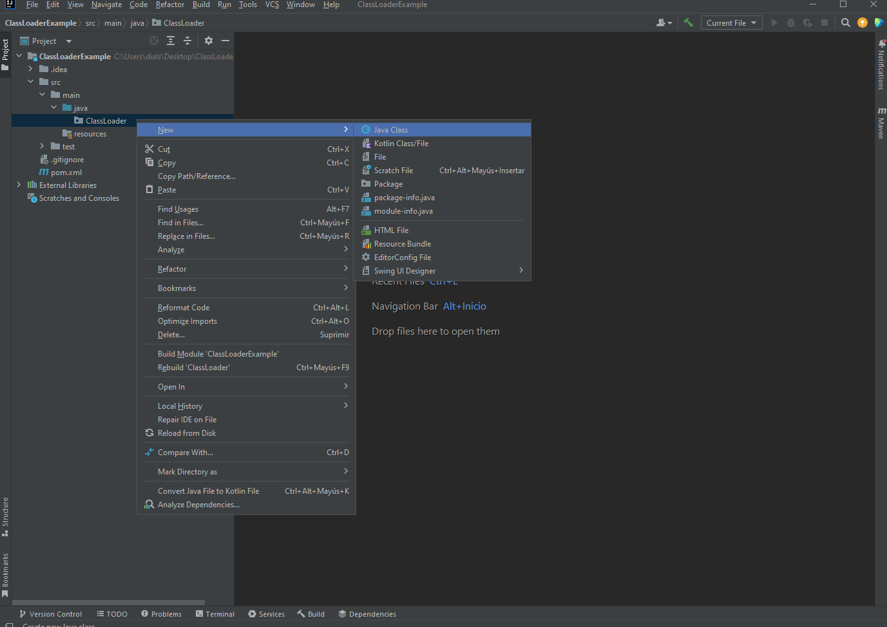
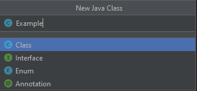
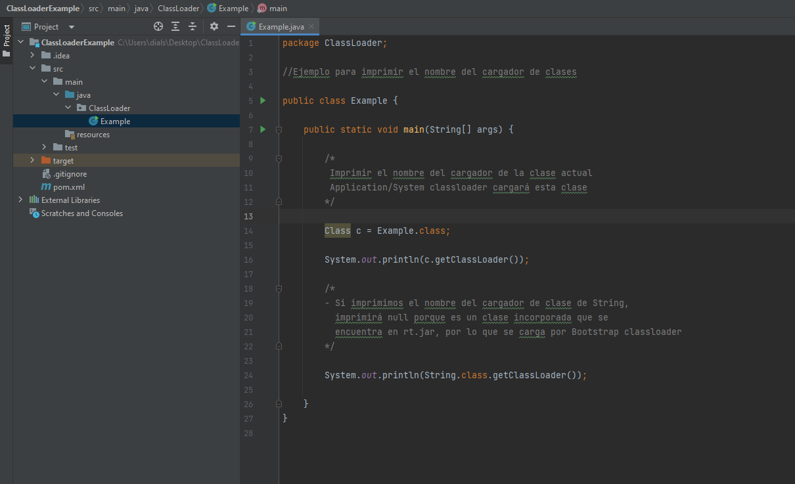
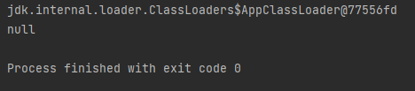

## Arquitectura de JVM (Java Virtual Machine)

- JVM es una máquina abstracta. Es una especificación que proporciona un entorno de ejecución en el que se puede ejecutar el código de bytes (bytecode) de Java.

- Las JVM están disponibles para muchas plataformas de hardware y sfotware, es decir, la JVM depende de la plataforma.

- La arquitectura interna de la JVM contiene: 
    - Cargador de clases.
    - Área de memoria.
    - Motor de ejecución, entre otros. 

1. Classloader (Cargador de clase):

- El cargador de clases es un subsistema de la JVM que se utiliza para cargar archivos de clase.
- Cada vez que ejecutamos el programa java, es cargador primero por el cargador de clases.
- Hay tres cargadores de clase incorporados en Java:
    1. Cargador de clases Bootstrap:
        - Este es el primer cargador de clase que es la super clase de Extension classloader.
        - Carga el archivo rt.jar que contiene todos los archivos de clase de Java Standard Edition como clases del paquete java.lang, clases del paquete java.net, clases del paquete java.util, clases del paquete java.io, clases del paquete java.sql, etc.

    2. Extension ClassLoader: 
        - Este es el cargador de clases hijo de Bootstrap y el cargador de clases padre del cargador de clases System.
        - Carga los archivos jar ubicados dentro del directorio $JAVA_HOME/jre/lib/ext.

    3. Cargador de clase System/Appicaction:
        - Es el cargador hijo del cargador extensión.
        - Carga los archivos de clase desde el classpath.
        - Por defecto, el classpath se establece en el directorio actual.
        - Puedes cambiar el classpath usando "-cp" o "-classpath".
        - También se conoce como cargador de aplicaciones.

2.  Class (Method) Area (Clase Área):

- La clase área almacena estructuras por clase como el pool de constantes en tiempo de ejecución, datos de campos,métodos y el código de los métodos.

3. Heap:

- Es el área de datos en tiempo de ejecución en la que se asignan los objetos.

4. Stack:

- La pila de java almacena marcos. 
- Contiene variables locales y resultados parciales.
- Participa en la invocación y devolución de métodos.
- Cada hilo tiene una pila JVM privada, creada al mismo tiempo que el hilo.
- Se crea un nuevo marco cada vez que se invoca un método. Un marco se destruye cuando finaliza la invocación de su método.

5. Program Counter Register (Registro del contador de programa):

- El registro PC (contador de programa) contiene la dirección de la instrucción de la máquina virtual Java que se está ejecutando en ese momento.

6. Native Method Stack (Pila de métodos nativos): 

- Contiene todos los métodos nativos utilizados en la aplicación.

7. Execution Engine (Motor de ejecución): 

- Contiene:

    1. Un procesador virtual
    2. Un intérprete: 
        - Lee el flujo de código de bytes y luego ejecuta las instrucciones. 
    3. Compilador Just-In-Time(JIT): 
        - Se utiliza para mejorar el rendimiento. 
        - JIT compila partes del código de bytes que tienen una funcionalidad similar al mismo tiempo, y por lo tanto reduce la cantidad de tiempo necesario para la compilación.
        - Aquí, el término "compilador" se refiere a un traductor del conjunto de instrucciones de una máquina virtual Java (JVM) al conjunto de instrucciones de una CPU específica.

8. Java Native Interface (Interfaz nativa de Java):

- Es un framework que proporciona una interfaz para comunicarse con otra aplicación escrita en otro lenguaje como C, C++, Assembly, etc.
- Java utiliza el marco JNI para enviar la salida a la consola o interactuar con las bibliotecas del sistema operativo.

## Ejemplo código ClassLoader

- Instalar [IntelliJ IDEA](https://www.jetbrains.com/es-es/idea/download/?section=windows) para codificar.

- Crear un nuevo proyecto:

- Crear un nuevo paquete:

- Colocar nombre al paquete:

- Crear una nueva clase java:

- Colocar nombre a la clase java:

- Ejemplo código ClassLoader:

- Resultado:

