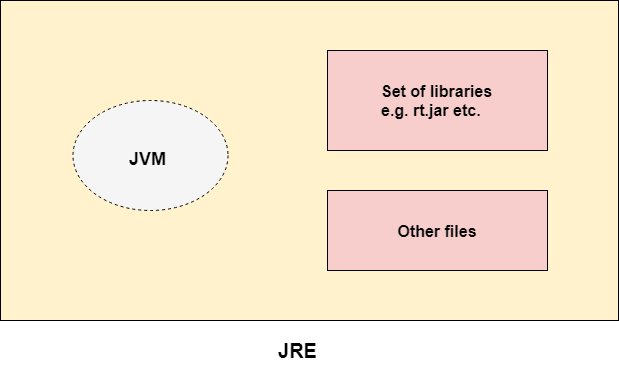

## JRE

- JRE es el acrónimo de Java Runtime Environment.
- También se escribe como Java RTE.
- JRE es un conjunto de herramientas de software que se utilizan para desarrollar aplicaciones Java.
- Se utiliza para proporcionar el entorno de ejecución.
- Contiene un conjunto de bibliotecas y otros archivos que JVM utiliza en tiempo de ejecución.

