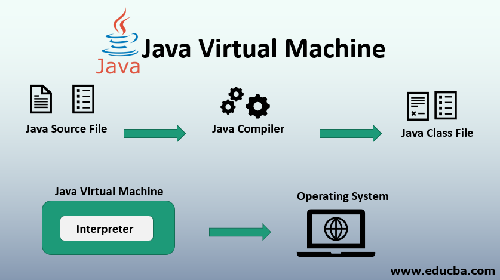

## JVM

- JVM es el acrónimo de Java Virtual Machine.
- Es una especificación del funcionamiento de la Máquina Virtual Java, pero el proveedor de la implementación es independiente para elegir el algoritmo.
- Su implementación ha sido proporcionada por Oracle y otras empresas.
- Una implementación se conoce como JRE.
- Instancia en tiempo de ejecución cada vez que se escribe el comando Java en el símbolo del sistema para ejecutar la clase java, se crea una instancia de JVM.

## ¿Qúe hace JVM?

- Carga el código.
- Verifica el código.
- Ejecuta el código.
- Proporciona el entorno de ejecución
- JVM proporciona información:
    - Formato del archivo de clase.
    - Conjunto de registros.
    - Montón de basura.
    - Notificación de errores fatales, etc.

