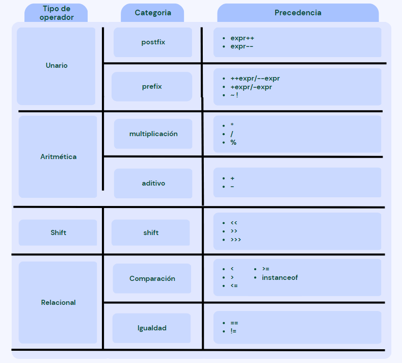

## Operadores en Java

- Operador en Java es un símbolo que se utiliza para realizar operaciones. 
- Por ejemplo: +, -, *, /, etc.

- Hay muchos tipos de operadores en Java que se dan a continuación:

    - Operador Unario
    - Operador Aritmético
    - Operador Shift
    - Operador Relacional
    - Operador Bitwise
    - Operador Lógico
    - Operador Ternario 
    - Operador de asignación

## Precedencia de operadores Java




## Operador unario de Java

- Los operadores unarios de Java sólo requieren un operando.

- Operadores unarios se utilizan para realizar diversas operaciones, es decir:

    - Aumentar/disminuir un valor en uno
    - Negación de una expresión
    - Invertir el valor de un booleano

## Ejemplo de Operador Unario Java: ++ y --

```Java
public class Example{
    public static void main(String args[]){
        int x = 10;
        System.out.println(x++) // 10 -> 11
        System.out.println(++x) // 12
        System.out.println(x--) // 12 -> 11
        System.out.println(--x) // 10
    }
}
```
```
Output:
10
12
12
10
```

## Ejemplo 2 de Operador Unario Java: ++ y --

```Java
public class Example{
    public static void main(String args[]){
        int x = 10;
        int y = 10;
        System.out.println(x++ + ++x) // 10 + 12 -> 22
        System.out.println(y++ + y++) // 10 + 11 = 21   
    }
}
```
```
Output:
22
21
```

## ## Ejemplo 2 de Operador Unario Java: ~ y !

```Java
public class Example{
    public static void main(String args[]){
        int x = 10;
        int y = -10;
        boolean c = true;
        boolean d = false;
        System.out.println(~x) // -11
        System.out.println(~y) // 9   
        System.out.println(!c) // false
        System.out.println(!d) // true    
    }
}
```
```
Output:
-11
9
false
true
```

## Operadores aritméticos de Java

- Los operadores aritméticos de Java se utilizan para realizar sumas, restas, multiplicaciones y divisiones. 

- Actúan como operaciones matemáticas básicas.

## Ejemplo de operador aritmético Java

```Java
public class Example{
    public static void main(String args[]){
        int x = 10;
        int y = 5;
        System.out.println(x+y) // 15
        System.out.println(x-y) // 5   
        System.out.println(x*y) // 50
        System.out.println(x/y) // 2
        System.out.println(x%y) // 0    
    }
}
```
```
Output:
15
5
50
2
0
```

## Ejemplo de Operador Aritmético Java: Expresión

```Java
public class Example{
    public static void main(String args[]){
        System.out.println(10*10/5+3-1*4/2);    
    }
}
```
```
Output:
21
```

## Operador de desplazamiento a la izquierda de Java

- El operador de desplazamiento a la izquierda "<<" de Java se utiliza para desplazar todos los bits de un valor a la izquierda de un número especificado de veces.

## Ejemplo de operador de desplazamiento a la izquierda en Java

```Java
public class Example{
    public static void main(String args[]){
        System.out.println(10<<2);//10*2^2=10*4=40  
        System.out.println(10<<3);//10*2^3=10*8=80  
        System.out.println(20<<2);//20*2^2=20*4=80  
        System.out.println(15<<4);//15*2^4=15*16=240   
    }
}
```
```
Output:
40
80
80
240
```

## Operador de desplazamiento a la derecha de Java

- El operador de desplazamiento a la derecha >> de Java se utiliza para desplazar el valor del operando izquierdo a la derecha el número de bits especificado por el operando derecho.

## Ejemplo Operador de desplazamiento a la derecha de Java

```Java
public class Example{
    public static void main(String args[]){
        System.out.println(10>>2);//10/2^2=10/4=2  
        System.out.println(20>>2);//20/2^2=20/4=5  
        System.out.println(20>>3);//20/2^3=20/8=2     
    }
}
```
```
Output:
2
5
2
```

## Ejemplo de Operador Shift en Java: >> vs >>>

```Java
public class Example{
    public static void main(String args[]){
        //Para números positivos, >> y >>> funcionan igual  
        System.out.println(20>>2);  
        System.out.println(20>>>2);  
        //Para número negativo, >>> cambia el bit de paridad (MSB) a 0
        System.out.println(-20>>2);  
        System.out.println(-20>>>2);      
    }
}
```
```
Output:
5
5
-5
1073741819
```


## Ejemplo del Operador AND de Java: Lógica && y Bitwise &

- El operador lógico && no comprueba la segunda condición si la primera es falsa. 

- Comprueba la segunda condición sólo si la primera es verdadera.

- El operador bit a bit & siempre comprueba ambas condiciones, tanto si la primera es verdadera como falsa.

```Java
public class Example{
    public static void main(String args[]){
        int a=10;  
        int b=5;  
        int c=20;  
        System.out.println(a<b&&a<c);//false && true = false  
        System.out.println(a<b&a<c);//false & true = false       
    }
}
```
```
Output:
false
false
```

## Ejemplo del Operador AND de Java: Lógico && vs Bitwise &

```Java
public class Example{
    public static void main(String args[]){
        int a=10;  
        int b=5;  
        int c=20;  
        System.out.println(a<b&&a++<c);//false && true = false  
        System.out.println(a);//10 porque no se comprueba la segunda condición
        System.out.println(a<b&a++<c);//false && true = false  
        System.out.println(a);//11 porque se comprueba la segunda condición
    }
}
```
```
Output:
false
10
false
11
```

## Ejemplo Operador Java OR: Lógico || y Bitwise |

- El operador lógico || no comprueba la segunda condición si la primera es verdadera.

- Comprueba la segunda condición sólo si la primera es falsa.

- El operador bitwise || siempre comprueba ambas condiciones, tanto si la primera es verdadera como falsa.

```Java
public class Example{
    public static void main(String args[]){
        int a=10;  
        int b=5;  
        int c=20;  
        System.out.println(a>b||a<c);//true || true = true  
        System.out.println(a>b|a<c);//true | true = true  
        //|| vs |  
        System.out.println(a>b||a++<c);//true || true = true  
        System.out.println(a);//10 porque no se comprueba la segunda condición 
        System.out.println(a>b|a++<c);//true | true = true  
        System.out.println(a);//11 porque se comprueba la segunda condición
}
```
```
Output:
true
true
true
10
true
11
```

## Operador ternario Java

- El operador ternario de Java se utiliza como sustituto en una línea de la sentencia if-the-else y se utiliza mucho en la programación Java. Es el único operador condicional que toma tres operandos.

```Java
public class Example{
    public static void main(String args[]){
        int a=2;  
        int b=5;  
        int min=(a<b)?a:b;  
        System.out.println(min); 
}
```
```
Output:
2
```

## Otro ejemplo:

```Java
public class Example{
    public static void main(String args[]){
        int a=10;  
        int b=5;  
        int min=(a<b)?a:b;  
        System.out.println(min); 
}
```
```
Output:
5
```

## Operador de asignación de Java

- El operador de asignación de Java es uno de los operadores más comunes.

- Se utiliza para asignar el valor de su derecha al operando de su izquierda.

## Ejemplo de Operador de Asignación Java

```Java
public class Example{
    public static void main(String args[]){
        int a=10;  
        int b=20;  
        a+=4;//a=a+4 (a=10+4)  
        b-=4;//b=b-4 (b=20-4)  
        System.out.println(a);  
        System.out.println(b);  
}
```
```
Output:
14
16
```

## Ejemplo de operador de asignación de Java

```Java
public class Example{
    public static void main(String args[]){
        int a=10;  
        a+=3;//10+3  
        System.out.println(a);  
        a-=4;//13-4  
        System.out.println(a);  
        a*=2;//9*2  
        System.out.println(a);  
        a/=2;//18/2  
        System.out.println(a);   
}
```
```
Output:
13
9
18
9
```

## Ejemplo de Operador de Asignación Java: Añadir short

```Java
public class Example{
    public static void main(String args[]){
        short a=10;  
        short b=10;  
        //a+=b;//a=a+b internamente esta bien 
        a=a+b;//Error de compilación porque 10 + 10 = 20 ahora int
        System.out.println(a);   
}
```
```
Output:
Compile time error
```

## Después del reparto de tipos:

```Java
public class Example{
    public static void main(String args[]){
        short a=10;  
        short b=10;  
        a=(short)(a+b);//20 que es int ahora convertido a short
        System.out.println(a);   
}
```
```
Output:
20
```