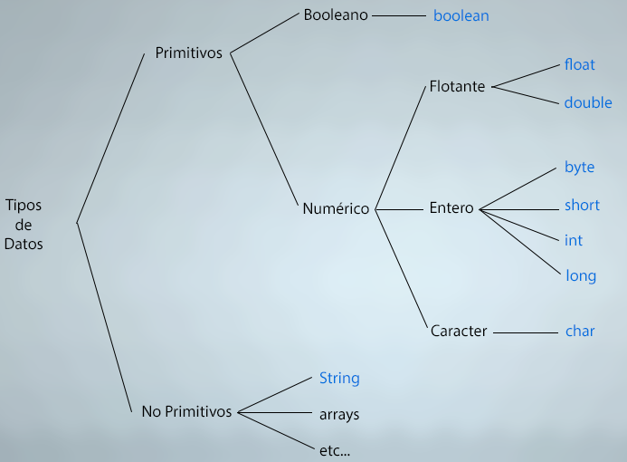
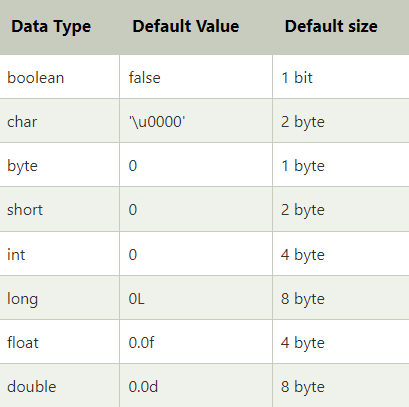

## Tipos de datos en Java

- Los tipos de datos especifican los diferentes tamaños y valores que pueden almacenarse en la variable.
- Hay dos tipos de datos en Java:
    - Tipos de datos primitivos: Los tipos de datos primitivos incluyen boolean, char, byte, shot, int, long, float y double.
    - Tipos de datos no primitivos: Los tipos de datos no primitivos incluyen clases, interfaces y arrays.

## Tipos de datos primitivos

- En Java, los tipos de datos primitivos son los componentes básicos de la manipulación de datos.
- Son los tipos de datos más básicos disponibles en el lenguaje Java.

```
- Java es un lenguaje de programación de tipado estático.
- Esto significa que todas las variables deben ser declaradas antes de su uso.
- Por eso necesitamos declarar el tipo y el nombre de las variables
```

- Existen 8 tipos de datos primitivos:

- Tipo de dato booleano
    - boolean 
- Tipo de dato númerico:
    - Flotantes:
        - float
        - double

    - Entero:
        - byte
        - short
        - int
        - long

    - Caracter:
        - char
   





## Tipo de dato Boolean

- El tipo de dato booleano se utiliza para almacenar sólo dos valores posibles:
    - Verdadero
    - Falso
- Este tipo de dato se utiliza para indicadores simple que registran condiciones.

- El tipo de dato booleano especifica un bit de información, pero su "tamaño" no puede definirse con precisión.

```Java
boolean a = false;
```

## Tipo de dato Byte

- El tipo de dato byte es un ejemplo de tipo de datos primitivos.

- Es un entero de 8 bits con signo y complemento a dos. 

- Su rango de valores está comprendido entre -129 y 127.

- Su valor mínimo es -128 y su valor máximo es 127.
- Su valor por defecto es 0.

- Este tipo de dato se utiliza para ahorrar memoria en matrices grandes, donde el ahorro de memoria es más necesario.

- Ahorra espacio porque un byte es 4 veces más pequeño que un entero.

```Java
byte a = 10;
byte b = -20;
```
## Tipo de dato Short

- El tipo de dato short es un entero de 16 bits con signo y complemento a dos.

- Su rango de valores está comprendido entre -32.768 y 32.767.

- Su valor mínimo es -32.768 y su valor máximo es 32.767.

- Su valor por defecto es 0.

- Este tipo de dato también puede utilizarse para ahorrar memoria, al igual que el tipo de dato byte.

- Un tipo de dato short es 2 veces más pequeño que un entero.

```Java
short s = 10000;
short r = -5000;
```

## Tipo de dato Int

- El tipo de dato entero tiene 32 bits con signo y complemento a dos.

- Su rango de valores está comprendido entre -2.147.483.648 (-2^31) y 2.147.483.647 (2^31 -1).

- Su valor mínimo es  - 2.147.483.648 y su valor máximo es 2.147.483.647. 

- Su valor por defecto es 0.

- Este tipo de dato se utiliza generalmente como tipo de dato por defecto, para valores integrales a menos que no haya problemas de memoria.

Su valor mínimo es - 9.223.372.036.854.775.808 y su valor máximo es 9.223.372.036.854.775.807.

## Tipo de dato Long

- El tipo de dato long es un entero de 64 bits en complemento a dos.

- Su rango de valores está comprendido entre -9.223.372.036.854.775.808(-2^63) y 9.223.372.036.854.775.807(2^63 -1).

- Su valor mínimo es - 9.223.372.036.854.775.808 y su valor máximo es 9.223.372.036.854.775.807.

- Su valor por defecto es 0.

- Este tipo de dato se utiliza cuando se necesita un rango de valores superior al proporcionado por int.

```Java
long a = 100000L;
long b = 200000L;
```

## Tipo de dato Float

- El tipo de dato flotante es de 32 bits de precisión simple, cuyo rango de valores es ilimitado.

- Se recomiendo utilizar float (en lugar de double) si necesita ahorrar memoria en grandes matrices de números de coma flotante.

- El tipo de dato float no debe utilizarse nunca para valores precisos, como la moneda.

- Su valor por defecto es 0.0F

```Java
float a = 10000.5f;
float b = -5000.3f;
```

## Tipo de dato Double

- El tipo de dato double es una coma flotante de 64 bits y doble precisión.

- Su rango es ilimitado.

- El tipo de dato double se utiliza generalmente para valores decimales, al igual que float.

- Este tipo de dato tampoco debe utilizarse nunca para valores precisos, como la moneda.

- Su valor por defecto es 0.0d.

```Java
double a = 12.3;
```

## Tipo de dato Char

- El tipo de dato char es un único carácter Unicode de 16 bits.

- Su rango de valores está comprendido entre  '\u0000' (0) y '\uffff' (65.535).

```Java
char a = 'A';
```