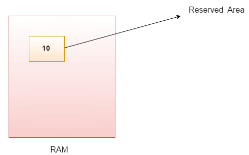

## Variables Java

- Una variable es un contenedor que mantiene el valor mientras se ejecuta el programa Java.
- A una variable se le asigna un tipo de datos.
- Variable es un nombre de ubicación de memoria. 

- Existen tres tipos de variables en java: 
    - Locales.
    - De instancia.
    - Estáticas.

- Hay dos tipos de datos en Java:
    - Primitivos.
    - No primitivos.


## Variable

- Una variable es el nombre de un área reservada asignada en memoria. En otras palabras, es el nombre de una posición de memoria.
- Es una combinación de "vary + able", lo que significa que su valor puede modificarse.



- Ejemplo:

 ```
  int data = 50; //Aquí los datos son variables
```

## Tipos de variables

- En Java existen tres tipos de variables:
    - Variable local
    - Variable de instancia
    - Variable estática

1. Variable local:
    - Una variable declarada dentro del cuerpo del método se llama variable local.
    - Puede utilizar esta variable sólo dentro de ese método y los otros métodos de la clase ni siquiera son conscientes de que existe la variable.
    - Una variable local no se puede definir con la palabra clave "static".

2. Variable de instancia:
    - Una variable declarada dentro de la clase pero fuera del cuerpo del método, se denomina variable de instancia. No se declara como estática.

    - Se denomina variable de instancia porque su valor es específico de una instancia y no se comparte entre instancias.

3. Variable estática:

    -  Una variable declarada como estática se denomina variable estática. No puede ser local
    - Se puede crear una única copia de la variable estática y compartila entre todas las instancias de la clase.
    - La asignación de memoria para las variables estáticas ocurre sólo una vez cuando la clase se carga en la memoria.

## Ejemplos para poder entender los tipos de variables en Java

```Java
  public class example{
    public static void main(String args[]){
    int data = 50; //variable de instancia
    }
    static int m = 100; //variable estática

    void method(){
        int n = 90; //variable local
    }
  }
```

## Ejemplo Suma de dos números

```Java
  public class Suma{
    public static void main(String args[]){
    int a = 50; 
    int b = 10;
    int c = a + b;
    System.out.println(c);
    }
  }
```
```
Output: 
c: 20
```

## Ejemplo Ampliación (Widening)

```Java
  public class Example{
    public static void main(String args[]){
    int a = 50; 
    float b = a;
    System.out.println(a);
    System.out.println(b);
    }
  }
```
```
Output: 
a: 50 
b: 50.0
```

## Ejemplo Estrechamiento de variable (Encasillamiento)

```Java
  public class Example{
    public static void main(String args[]){
    float b = 10.5f;
    int a = f; //Va a soltar error debido a que son distintos tipos de datos
    int a = (int)f;
    System.out.println(b);
    System.out.println(a);
    }
  }
```
```
Output: 
b: 10.5
a: 10
```

## Ejemplo Desbordamiento

```Java
  public class Example{
    public static void main(String args[]){
    int a = 130; 
    byte b = (byte)a
    System.out.println(a);
    System.out.println(b);
    }
  }
```
```
Output: 
a: 130
b: 126
```

## Ejemplo suma de números tipo byte

```Java
  public class Example{
    public static void main(String args[]){
    byte a = 10; 
    byte b = 10
    // byte c = a + b; //Soltara un error debido a que el resultado sera un entero, por lo tanto byte != int 
    byte c = (byte)(a+b);
    System.out.println(c);
    }
  }
```
```
Output: 
c = 20
```